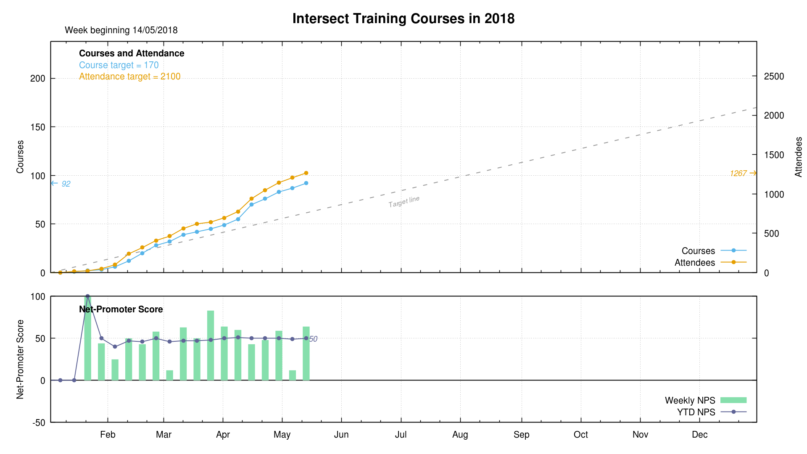
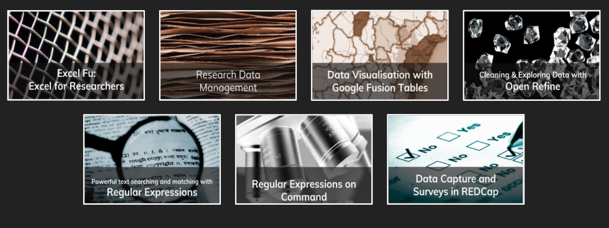
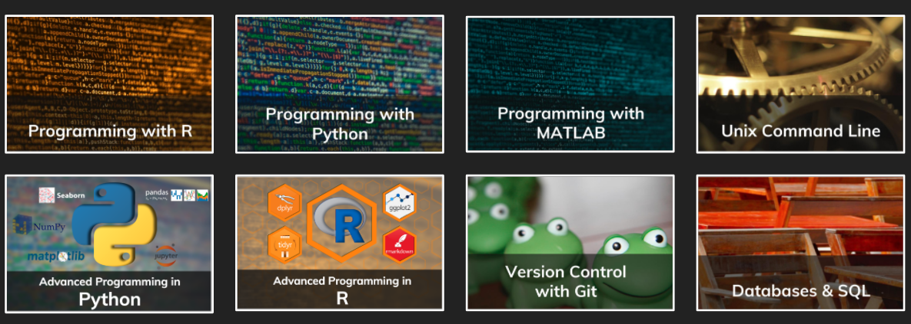

@title[Introduction]

# Managing engagement content and delivery

Dr Paddy Tobias, eResearch Analyst

Intersect Australia

Note:
* talk about the process Intersect is going through to professionalise our training delivery, and why?
* As the university library is changing in its role and its clientele are changing (I don't think that's too controversial to say), I imagine there is some motivations in this library to effectively engage your primary stakeholders
* well Intersect is going through a similar process at the moment, about how to provide service delivery most effectively!
* for intersect, our main offering to universities has been our training program. we are the biggest training provider specifically for researchers, in Aust, a position which we have fallen into, rather than by grand strategy

---
## First, some questions...
* What group sessions does the Library run? By whom? |
* How are sessions delivered? |
* What type of supporting material is there? |
* How are these materials managed and kept current? |
* How are materials distributed? |
---
## Intersect
* Non-profit eResearch technology company
* Formed in 2008 with state and federal grants
* And investment by NSW Universities
* Jointly owned and directed by a consortium of **12** Australian Universities (our Members)
* With **4** affiliate members
* Operating across **4** states and territories

+++
## Training

Over the years, we have trained:
* **7837** researchers
* in **742** trainings
* across **4** states and territories

+++

Note:
And.. these numbers are growing year on year
* 28 % increase on trainings '16-'17
* 45% increase on attendance '16-'17
---

## Course administration
Our training covers:
* **17** unique courses (soon to be *19*)
* ran at **14** institutions
* with **20+** trainers

+++
## Data courses

+++
## Computing courses

+++
## Software courses

+++
## Other engagements...
* HDR program
* Information sessions
* Drop-in sessions (aka "Hacky Hour")

---
## Common challenges
* Keeping material up-to-date
* ... and "fresh"
* Co-writing courses
* Consistency of presentation and delivery
* In-training engagement
* Post-training distribution

---

## Current project
To ...
* standardise our content delivery and presentation |
* find a suitable, central (online) platform to publish our course material |
* find a way to manage current content and support course development |

---

## GitHub Pages
... to standardise engagement
e.g., Intersect's [Qualtrics course - UNDER DEV](https://intersectaustralia.github.io/surveys-with-qualtrics/)

* renders text files (written in Markdown) into a website... free! |
* creates a website from a GitHub repository... free! |
* powered by Jekyll, a static site generator |
* remote themes, to standardise styling with CSS |
* very flexible and lots of options: https://github.com/jekyll/jekyll/wiki/Themes |

+++

## GitHub
... for content management

* version control |
* manages collaborative writing |
* project management plug-ins |
* promotes Open Data! |

e.g., [GitHub repository](https://github.com/IntersectAustralia/surveys-with-qualtrics)

+++
## GitPitch
... presentations

* remote themes, again standardising styling
* loads of features for the presenter
* can sit within GitHub repo so everything is contained

e.g., [GitPitch presentation](https://gitpitch.com/intersectAustralia/surveys-with-qualtrics#/)

*
Note:
And if that wasn't enough!
